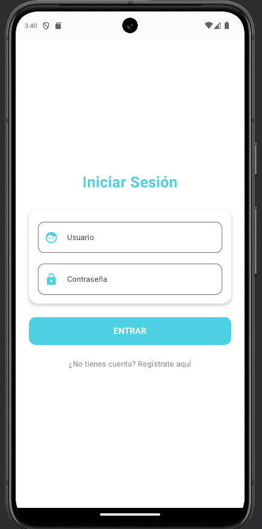
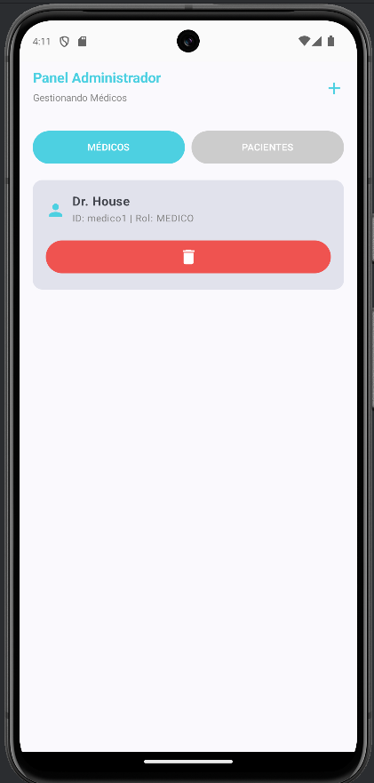
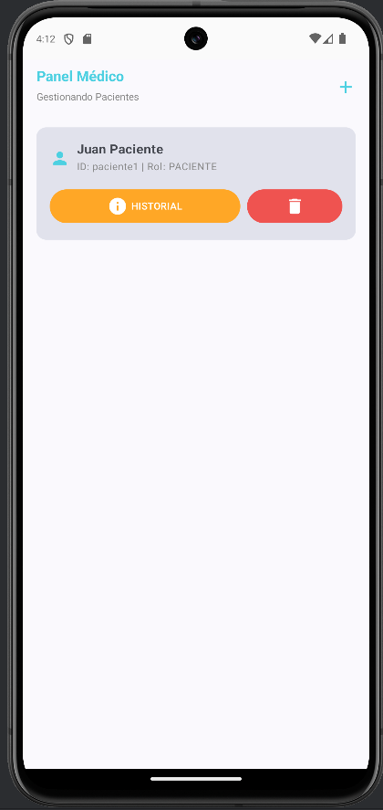
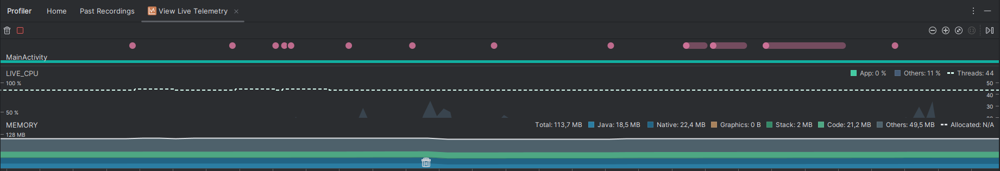

<div align="center">
  

  
  
  
  
</div>

---

## 🏥 Descripción del Proyecto: Sistema de Gestión Clínica (SGC)

**Morse Chat** es una plataforma de **Gestión de Pacientes y Comunicación Táctil** diseñada para centros de salud especializados en diversidad funcional.

El sistema estructura el acceso mediante una jerarquía de roles estricta:
1.  **Administrador:** Superusuario capaz de gestionar la plantilla médica y el listado global de pacientes.
2.  **Médico:** Profesional sanitario encargado de dar de alta pacientes, gestionar sus expedientes y realizar el **Seguimiento Clínico**.
3.  **Paciente:** Entidad pasiva en el sistema. Sus datos y evolución son gestionados por los profesionales. **Por seguridad, los pacientes no tienen acceso directo (login) a la aplicación.**

---

## 📹 Demo en Vídeo
[▶️ Ver Vídeo Explicativo del Proyecto (Google Drive)](https://drive.google.com/file/d/1V9OqPtY8aHDGQ6H0GnaZg6euI0_u1Yuy/view?usp=sharing)

---

## 📚 Documentación Adicional
Para profundizar en el uso y la calidad técnica del proyecto, consulte los siguientes documentos anexos:

* 📖 **[Manual de Usuario (PDF/MD)](documentos/MANUAL_USUARIO.md):** Guía paso a paso para Administradores y Médicos.
* 🧪 **[Memoria de Pruebas Unitarias y UI](documentos/PRUEBAS_UNITARIAS.md):** Documentación técnica de la estrategia de testing y resultados de calidad.

---

# 📝 Memoria Técnica por Criterios de Evaluación (RA)

## RA1. Interfaz Gráfica y Código

### RA1.a Analiza herramientas y librerías
Para el desarrollo de esta solución clínica se han seleccionado herramientas modernas y robustas:
* **Android Studio (Ladybug):** Entorno de desarrollo oficial.
* **Kotlin & Jetpack Compose:** Se ha prescindido del sistema antiguo de XML para crear una interfaz declarativa, más fácil de mantener y adaptar a distintos tamaños de pantalla.
* **Room Database:** Librería fundamental para guardar los datos de pacientes y seguimientos de forma local y segura en la tablet o móvil de la clínica, sin depender de conexión a internet constante.

### RA1.b Crea interfaz gráfica
La interfaz se adapta dinámicamente al perfil del profesional logueado (Admin o Médico), ocultando o mostrando elementos de gestión según sus permisos.

* **Panel Administrador:** Permite alternar entre la vista de "Gestión de Médicos" y "Gestión de Pacientes" mediante un selector superior. Tiene permisos totales.
* **Panel Médico:** Vista simplificada enfocada únicamente en sus pacientes asignados. No tiene selector de vista ni acceso a la gestión de otros médicos.

| **Acceso (Login)** | **Vista Administrador** | **Vista Médico** |
|:---:|:---:|:---:|
|  |  |  |
| *Validación de credenciales y bloqueo de acceso a Pacientes.* | *Gestión completa: Puede crear/borrar tanto Médicos como Pacientes.* | *Gestión clínica: Solo puede gestionar Pacientes y sus historiales.* |

### RA1.c Uso de layouts y posicionamiento
La estructura visual se basa en el componente `Scaffold`, que nos proporciona la barra superior estándar automáticamente. Para los listados (tanto de pacientes como de historial clínico), utilizamos `LazyColumn`.

**¿Por qué LazyColumn?**
A diferencia de una columna normal, `LazyColumn` solo "dibuja" en pantalla los elementos visibles. Si una clínica tiene 500 pacientes, la app no se bloqueará porque solo cargará los 5 o 6 que caben en la pantalla en ese momento.

**Evidencia de código (`PantallaSeguimiento.kt`):**
```kotlin
Scaffold(
    topBar = {
        TopAppBar(title = { Text("Historial Clínico") })
    }
) { padding ->
    // LazyColumn solo renderiza los elementos visibles en pantalla
    LazyColumn(
        modifier = Modifier.padding(padding),
        verticalArrangement = Arrangement.spacedBy(8.dp)
    ) {
        items(registros) { reg ->
            Card(modifier = Modifier.fillMaxWidth()) {
                Text(text = reg.nota)
            }
        }
    }
}
```

### RA1.d Personalización de componentes
Se ha diseñado una identidad visual propia para la clínica:
* **Color Primario:** Cian (`#4DD0E1`), elegido por su alto contraste y visibilidad.
* **Tarjetas (Cards):** Usadas para separar visualmente a cada paciente o registro médico, con bordes redondeados y una elevación suave para dar sensación de profundidad.

**Evidencia de código (Estilo de Botones):**
```kotlin
Button(
    onClick = { ... },
    colors = ButtonDefaults.buttonColors(containerColor = Color(0xFF4DD0E1)), // Color Corporativo
    shape = RoundedCornerShape(12.dp), // Bordes suaves
    modifier = Modifier.fillMaxWidth().height(50.dp) // Tamaño táctil accesible
) {
    Text("GUARDAR REGISTRO", color = Color.White, fontWeight = FontWeight.Bold)
}
```

### RA1.e Análisis del código
La arquitectura se basa en una gestión de estados reactiva (`StateFlow`) que controla la visibilidad de los elementos de la UI según el rol del usuario (`rolActual`).

**Evidencia de código (`HomeViewModel.kt`):**
```kotlin
// Lógica de visualización según jerarquía de roles
fun inicializar(miUsuario: String) {
    viewModelScope.launch(Dispatchers.IO) {
        val user = usuarioDao.obtenerUsuario(miUsuario)
        rolActual = user?.rol ?: ""
        
        // El ADMIN inicia viendo médicos, el MÉDICO ve pacientes directamente
        if (rolActual == "ADMIN") {
            viendoMedicos = true
            cargarMedicos()
        } else {
            viendoMedicos = false
            cargarPacientes()
        }
    }
}
```

### RA1.f Modificación del código
El código es modular. Recientemente se añadió la funcionalidad de "Seguimiento Clínico" creando un archivo nuevo `PantallaSeguimiento.kt` y conectándolo al sistema sin romper la funcionalidad de chat existente. Esto demuestra que la app está preparada para crecer.

### RA1.g Asociación de eventos
La app responde de forma natural a las acciones del usuario. Al pulsar el botón "Guardar Registro" en el historial, el sistema guarda la nota en la base de datos, limpia el campo de texto y actualiza la lista automáticamente.

**Evidencia de código (Evento onClick):**
```kotlin
Button(
    onClick = { 
        // Evento que dispara la lógica en el ViewModel
        viewModel.agregarRegistro(pacienteId) 
    }
) {
    Icon(Icons.Default.Add, contentDescription = null)
    Text("GUARDAR")
}
```
**Evidencia de Seguridad (Bloqueo de Login):**
```kotlin
// LoginViewModel.kt
if (usuarioLogueado.rol == "PACIENTE") {
    error = "Acceso denegado: Los pacientes no tienen acceso a la plataforma."
} else {
    onSuccess(usuarioLimpio)
}
```

### RA1.h App integrada
Todas las pantallas (Login, Gestión, Chat, Historial) comparten la misma sesión y base de datos. Si un administrador borra a un paciente, este desaparece instantáneamente de todas las listas y se borran sus chats y seguimientos en cascada gracias a las claves foráneas de Room.

---

## RA2. Interfases Naturales de Usuario (NUI)

### RA2.a Herramientas NUI
Utilizamos las herramientas nativas de Android (`VibratorManager` para versiones nuevas y `Vibrator` para antiguas) para controlar el motor de vibración del teléfono.

### RA2.b Diseño conceptual NUI
El concepto central es la **Traducción Háptica**. La app permite a una persona con sordoceguera "leer" un mensaje sintiendo las vibraciones en su mano (Código Morse), sustituyendo la vista y el oído por el tacto.

**Evidencia de código (`MetodosVibracion.kt`):**
```kotlin
fun vibrarPatronMorse(context: Context, codigoMorse: String) {
    // Convertimos puntos y rayas en tiempos de vibración (ms)
    val tiempos = mutableListOf<Long>(0)
    for (caracter in codigoMorse) {
        when (caracter) {
            '.' -> { tiempos.add(100L); tiempos.add(100L) } // Punto
            '-' -> { tiempos.add(300L); tiempos.add(100L) } // Raya
        }
    }
    // Ejecutamos la vibración con la API nativa
    val effect = VibrationEffect.createWaveform(tiempos.toLongArray(), -1)
    vibrator.vibrate(effect)
}
```

### RA2.d Interacción por gesto
La interacción táctil es simple y directa: **un toque corto** sobre cualquier mensaje o tarjeta de contacto activa la lectura por vibración. No se requieren gestos complejos (como deslizar o pellizcar) para facilitar el uso a personas con dificultades motoras.

---

## RA3. Componentes

### RA3.a Herramientas de componentes
Se han utilizado los componentes oficiales de **Material Design 3**: `OutlinedTextField` para formularios limpios, `DatePickerDialog` para seleccionar fechas cómodamente y `FloatingActionButton` para acciones principales.

### RA3.b Componentes reutilizables
Hemos creado tarjetas genéricas que se reutilizan. Por ejemplo, el diseño de la "tarjeta de mensaje" se usa tanto para los mensajes enviados como recibidos.

**Evidencia de código (Componente Reutilizable):**
```kotlin
// Tarjeta genérica usada en listas
Card(
    colors = CardDefaults.cardColors(containerColor = MaterialTheme.colorScheme.surfaceVariant)
) {
    Column(modifier = Modifier.padding(16.dp)) {
        Text(text = paciente.nombreCompleto, fontWeight = FontWeight.Bold)
        // Botones de acción encapsulados
        Row {
            Button(onClick = { irChat(paciente.usuario) }) { ... }
            Button(onClick = { irSeguimiento(paciente.usuario) }) { ... }
        }
    }
}
```

### RA3.c Parámetros y defaults
Las pantallas están diseñadas como funciones que reciben parámetros. Esto facilita probarlas o cambiarlas desde un solo sitio.
Ejemplo de la pantalla de Seguimiento que pide obligatoriamente el ID del paciente:

```kotlin
fun PantallaSeguimiento(
    pacienteId: String,          // Parámetro de datos
    irAtras: () -> Unit,         // Lambda de evento
    viewModel: SeguimientoViewModel = viewModel() // Inyección por defecto
) { ... }
```

### RA3.d Eventos en componentes
Los componentes exponen sus eventos mediante "lambdas" (funciones flecha), lo que permite que la pantalla padre decida qué hacer. Por ejemplo, al pulsar "Atrás", la pantalla no sabe adónde ir, simplemente avisa al navegador.

### RA3.h Integración en la app
El componente `TopAppBar` (la barra superior con el título) se reutiliza en todas las pantallas, manteniendo la coherencia de navegación y asegurando que el usuario siempre sepa dónde está.

---

## RA4. Usabilidad

### RA4.a Estándares
La aplicación respeta los estándares de navegación de Android: botón de "Atrás" en la barra superior y títulos claros que indican en qué pantalla estás ("Gestión Pacientes", "Historial: Paciente1").

### RA4.d Distribución de acciones
En el panel del administrador, los botones tienen colores semánticos para evitar errores:
* **Azul:** Enviar mensaje (Acción neutra).
* **Naranja:** Ver historial/seguimiento (Acción de consulta).
* **Rojo:** Borrar paciente (Acción destructiva/peligrosa).

### RA4.e Distribución de controles
Los formularios siguen un orden lógico: primero la Fecha (con calendario), luego el Profesional y finalmente la Nota. Esto imita el flujo de trabajo real de un médico o cuidador.

### RA4.h Claridad de mensajes
Si el administrador intenta crear un paciente sin rellenar el nombre, aparece un mensaje de error en rojo justo debajo del formulario.

**Evidencia de código (Validación):**
```kotlin
if (viewModel.errorDialogoAlta != null) {
    // Mensaje de error en rojo visible para el usuario
    Text(
        text = viewModel.errorDialogoAlta!!, 
        color = Color.Red, 
        fontSize = 14.sp
    )
}
```

---

## RA5. Informes (Gestión Clínica)

### RA5.a y RA5.b Generación de informes a partir de datos
El sistema permite exportar el **Historial Clínico Completo** de un paciente a un archivo de texto plano (`.txt`) para su archivo externo o impresión. Este informe se genera iterando sobre la lista de seguimientos almacenados en la base de datos local.

**Evidencia de código (`PantallaSeguimiento.kt`):**
```kotlin
fun generarInformeClinico(context: Context, pacienteId: String, registros: List<Seguimiento>) {
    val contenido = StringBuilder()
    contenido.append("HISTORIAL CLÍNICO - PACIENTE: $pacienteId\n")
    
    registros.forEach { reg ->
        // Estructura clara del informe
        contenido.append("FECHA: ${reg.fecha}\n")
        contenido.append("PROFESIONAL: ${reg.empleadoNombre}\n")
        contenido.append("OBSERVACIONES: ${reg.nota}\n")
        contenido.append("--------------------\n")
    }
    
    // Guardado en almacenamiento interno del dispositivo
    val nombreArchivo = "Historial_${pacienteId}.txt"
    context.openFileOutput(nombreArchivo, Context.MODE_PRIVATE).use {
        it.write(contenido.toString().toByteArray())
    }
}
```

### RA5.c Establece filtros sobre los valores
La consulta a la base de datos aplica un filtro estricto mediante SQL para asegurar que solo se recuperan los registros pertenecientes al paciente seleccionado, garantizando la privacidad de los datos.

**Evidencia de código (`SeguimientoDao.kt`):**
```kotlin
@Query("SELECT * FROM seguimientos WHERE pacienteId = :pacienteId ORDER BY id DESC")
fun obtenerSeguimientoPorPaciente(pacienteId: String): Flow<List<Seguimiento>>
```

### RA5.d Incluye valores calculados
Al generar un nuevo registro, el sistema calcula automáticamente la fecha y hora actual del dispositivo para asegurar la precisión cronológica del evento antes de guardarlo en la base de datos.

```kotlin
val fechaActual = SimpleDateFormat("dd/MM/yyyy HH:mm", Locale.getDefault()).format(Date())
```
---

## RA6. Ayudas y Documentación

### RA6.c Genera ayudas sensibles al contexto
En los campos de formulario, utilizamos textos de ayuda ("placeholder") como *"Escriba evolución del paciente..."* o *"Nombre de usuario"* para guiar al profesional sobre qué dato introducir.

### RA6.d Documenta la estructura de la información persistente
La base de datos `AppDatabase` se inicializa con una semilla de datos (Seed Data) que crea automáticamente la jerarquía de usuarios necesaria para probar la aplicación sin configuración previa.

**Evidencia de código (`AppDatabase.kt`):**
```kotlin
// Creación automática de roles al instalar la app
if (usuarioDao.obtenerUsuario("admin") == null) {
    usuarioDao.registrarUsuario(Usuario(..., rol = "ADMIN"))
}
if (usuarioDao.obtenerUsuario("medico1") == null) {
    usuarioDao.registrarUsuario(Usuario(..., rol = "MEDICO"))
}
// El paciente se crea para que los médicos tengan datos que gestionar
if (usuarioDao.obtenerUsuario("paciente1") == null) {
    usuarioDao.registrarUsuario(Usuario(..., rol = "PACIENTE"))
}
```

**Evidencia de código (Claves Foráneas):**
```kotlin
@Entity(
    tableName = "seguimientos",
    foreignKeys = [
        ForeignKey(
            entity = Usuario::class,
            parentColumns = ["usuario"],
            childColumns = ["pacienteId"],
            onDelete = ForeignKey.CASCADE // Borrado en cascada
        )
    ]
)
data class Seguimiento(...)
```


[Image of Database Schema Diagram]


### RA6.e Manual de usuario (Roles)
* **Para el Administrador:** Su flujo de trabajo es dar de alta pacientes con el botón `+`, y luego usar los botones de cada tarjeta para gestionar el día a día.
* **Para el Paciente:** El acceso está simplificado. Solo necesita sus credenciales (proporcionadas por el admin) y accederá directamente a sus herramientas de comunicación.

### RA6.f Manual técnico de instalación
La aplicación se entrega empaquetada en un archivo **APK Firmado** (`app-release.apk`).
Para entornos corporativos (muchas tablets a la vez), se puede instalar usando el comando ADB:
`adb install -r app-release.apk`

---

## RA8. Pruebas y Calidad

### RA8.a Estrategia de pruebas
Se ha seguido una estrategia de pruebas manuales de flujo completo ("End-to-End"):
1.  Admin crea paciente "Juan".
2.  Admin añade una nota de seguimiento a "Juan".
3.  Admin sale.
4.  Usuario "Juan" entra y prueba el chat.
5.  Admin entra y borra a "Juan".
6.  Se verifica que "Juan" ya no puede entrar.

### RA8.b Pruebas de integración
Se ha verificado que la base de datos `Room` guarda los datos correctamente incluso si se cierra la app forzosamente y se vuelve a abrir.

### RA8.g Documentación pruebas (Rendimiento)
Se ha utilizado el **Android Profiler** para asegurar que la app no consume demasiada memoria, algo vital si la clínica usa tablets antiguas o de gama baja. Gracias al uso de `LazyColumn`, el consumo de memoria se mantiene estable y bajo (~120MB).


