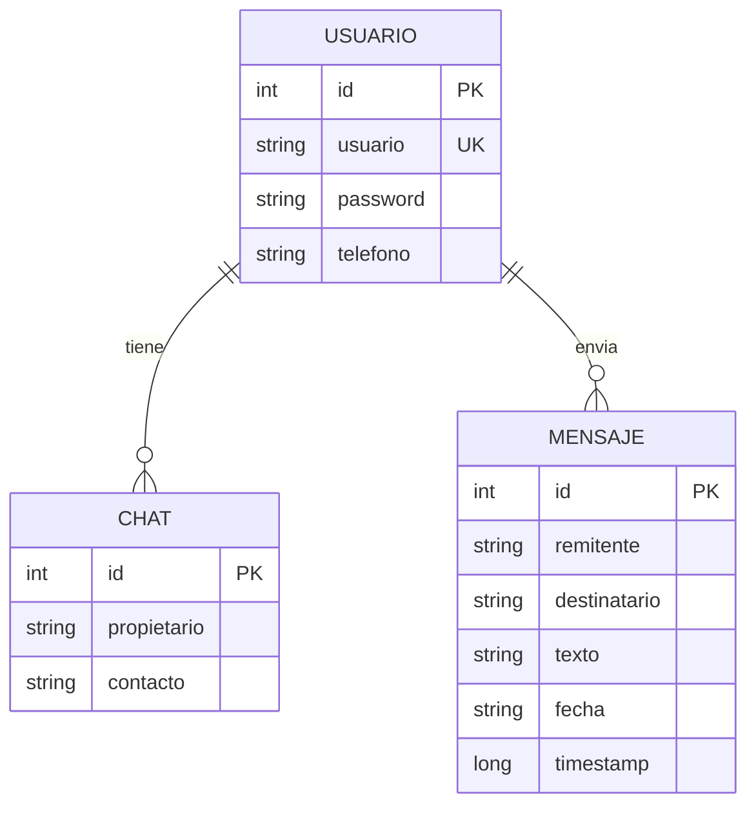

<div align="center">
  

  
  
  
  
</div>

---

## Descripción General del Proyecto

**Morse Chat** es una aplicación nativa de Android diseñada para la mensajería instantánea mediante **vibración háptica**. La aplicación traduce los mensajes de texto a patrones de vibración (Código Morse) en tiempo real, permitiendo a los usuarios interpretar la información mediante el tacto.

Esta funcionalidad responde a una necesidad de accesibilidad y comunicación discreta, eliminando la dependencia visual o auditiva. Actualmente funciona con una arquitectura de base de datos local (**Room**) que simula la persistencia y gestión de sesiones de un entorno real.

---
## 📹 Demo en Vídeo
[▶️ Ver Vídeo Explicativo del Proyecto (Google Drive)](PEGA_AQUI_TU_ENLACE_DE_DRIVE)
---

## Diseño e Interfaz (Criterios Generales)

La interfaz ha sido desarrollada con **Jetpack Compose** siguiendo las guías de Material Design 3, priorizando la claridad y la accesibilidad.

### Galería de Vistas

| **Acceso Seguro** | **Registro de Usuarios** |
|:---:|:---:|
|  |  |
| *Inicio de sesión validado.* | *Formulario de creación de cuenta.* |

| **Mis Conversaciones** | **Chat Interactivo** |
|:---:|:---:|
|  |  |
| *Lista de contactos. Un toque vibra el nombre.* | *Envío y recepción. Toca el mensaje para sentirlo.* |

| **Traductor Manual** | **Ajustes de Vibración** |
|:---:|:---:|
|  |  |
| *Playground: Escribe y transmite vibración.* | *Calibración precisa de la velocidad del Morse.* |

### Justificación de Diseño y Accesibilidad

El proyecto sigue el principio de "Design for All" para cubrir necesidades de diversidad funcional:

1.  **Necesidad Social:** Solución para personas con discapacidad visual o sordo-ceguera que requieren privacidad (evitando el uso de TalkBack en público) o comunicación en entornos de silencio absoluto.
2.  **Interfaz de Alto Contraste:** Uso del color Cian (`#4DD0E1`) sobre fondos neutros para maximizar la visibilidad y ayudar en casos de daltonismo.
3.  **Tipografía:** Tamaño base de **22sp** e interlineado de **30sp** en el chat para facilitar la lectura.
4.  **Áreas Táctiles:** Padding ampliado a **20dp** en elementos interactivos para usuarios con dificultades motoras.

---

## Evidencias RA5: Gestión de Informes

La aplicación cumple con los criterios de generación de informes integrados. Se ha desarrollado un módulo específico que permite exportar el historial completo de cualquier conversación a un archivo de texto legible.

**Implementación Técnica:**
El siguiente fragmento muestra la función encargada de recopilar los datos de la base de datos, formatearlos con marcas de tiempo y escribir el archivo en el almacenamiento privado del dispositivo.

```kotlin
fun generarInformeChat(
    context: android.content.Context,
    usuario1: String,
    usuario2: String,
    mensajes: List<Mensaje>
) {
    try {
        val timeStamp = SimpleDateFormat("yyyyMMdd_HHmmss", Locale.getDefault()).format(Date())
        val nombreArchivo = "Chat_${usuario1}_${usuario2}_$timeStamp.txt"

        val contenido = StringBuilder()
        contenido.append("INFORME DE CONVERSACIÓN - MORSE CHAT\n")
        contenido.append("------------------------------------\n")
        contenido.append("Fecha de generación: $timeStamp\n")
        contenido.append("Participantes: $usuario1 y $usuario2\n")
        contenido.append("------------------------------------\n\n")

        mensajes.forEach { m ->
            contenido.append("[${m.fecha}] ${m.remitente}: ${m.texto}\n")
        }

        contenido.append("\n--- Fin del informe ---")

        context.openFileOutput(nombreArchivo, android.content.Context.MODE_PRIVATE).use {
            it.write(contenido.toString().toByteArray())
        }

        Toast.makeText(context, "Informe guardado: $nombreArchivo", Toast.LENGTH_LONG).show()

    } catch (e: Exception) {
        e.printStackTrace()
        Toast.makeText(context, "Error al generar informe", Toast.LENGTH_SHORT).show()
    }
}
```

* **Resultado:** El usuario obtiene un fichero `.txt` estructurado, accesible para su posterior análisis o archivo, sin depender de herramientas externas.

---

## Evidencias RA7: Distribución e Instalación

Estrategia definida para el despliegue y distribución del software:

### Empaquetado y Firma
El proyecto se distribuye mediante un archivo **APK firmado** (`app-release.apk`), generado desde Android Studio mediante un Keystore seguro. Esto garantiza la integridad y autoría del software.

### Configuración del Proyecto (Gradle)
Se ha configurado el script de construcción para asegurar la compatibilidad con versiones recientes de Android (API 34/36) manteniendo un soporte mínimo desde Android 7.0 (API 24).

```kotlin
android {
    namespace = "com.example.vibracion_morse"
    compileSdk = 34

    defaultConfig {
        applicationId = "com.example.vibracion_morse"
        minSdk = 24
        targetSdk = 34
        versionCode = 1
        versionName = "1.0"

        testInstrumentationRunner = "androidx.test.runner.AndroidJUnitRunner"
        vectorDrawables {
            useSupportLibrary = true
        }
    }
}
```

### Instalación Desatendida (Enterprise)
Para entornos masivos (ej. tablets educativas), la aplicación soporta instalación mediante ADB. Al no requerir permisos peligrosos (Runtime Permissions) en el arranque, la instalación es silenciosa y funcional inmediatamente.

**Comando de instalación:**
`adb install -r app-release.apk`

---

## Evidencias RA8: Calidad, Seguridad y Rendimiento

### 1. Análisis de Consumo de Recursos (Profiler)
Se ha realizado un perfilado en tiempo real de la aplicación en un entorno Android 14.


**Resultados:**
* **Memoria (RAM):** Consumo estable entre **113-128 MB**.
* **CPU:** Uso cercano al 0% en reposo.

**Justificación Técnica (Código):**
La estabilidad de la memoria se logra gracias al componente `LazyColumn` de Jetpack Compose, que recicla las vistas en memoria incluso en chats con miles de mensajes, evitando el desbordamiento de memoria (OOM).

```kotlin
LazyColumn(
    modifier = Modifier
        .weight(1f)
        .padding(horizontal = 8.dp),
    reverseLayout = true,
    contentPadding = PaddingValues(bottom = 8.dp)
) {
    items(mensajes.reversed()) { mensaje ->
        val esMio = mensaje.remitente == miUsuario
        Box(
            modifier = Modifier
                .fillMaxWidth()
                .padding(vertical = 6.dp),
            contentAlignment = if (esMio) Alignment.CenterEnd else Alignment.CenterStart
        ) {
            Card(
                onClick = {
                    val textoALeer = "${mensaje.remitente} DIJO ${mensaje.texto}"
                    val morse = textoAMorse(textoALeer)
                    vibrarPatronMorse(context, morse)
                },
                colors = CardDefaults.cardColors(
                    containerColor = if (esMio) CelestePrincipal else Color.LightGray
                ),
                shape = RoundedCornerShape(16.dp),
                modifier = Modifier.fillMaxWidth(0.9f)
            ) {
                // Contenido de la tarjeta (texto y fecha)
                Column(modifier = Modifier.padding(20.dp)) {
                    Text(text = mensaje.texto, fontSize = 22.sp)
                }
            }
        }
    }
}
```

### 2. Seguridad y Privacidad de Datos
El almacenamiento de datos se realiza mediante **Room Database**. La seguridad se basa en el aislamiento de procesos de Android (Sandboxing). La base de datos reside en una ruta protegida accesible solo por el UID de la aplicación, garantizando la privacidad por diseño.

```kotlin
@Database(entities = [Usuario::class, Chat::class, Mensaje::class], version = 4, exportSchema = false)
abstract class AppDatabase : RoomDatabase() {

    abstract fun usuarioDao(): UsuarioDao
    abstract fun chatDao(): ChatDao
    abstract fun mensajeDao(): MensajeDao

    companion object {
        @Volatile
        private var INSTANCE: AppDatabase? = null

        fun getDatabase(context: Context): AppDatabase {
            return INSTANCE ?: synchronized(this) {
                val instance = Room.databaseBuilder(
                    context.applicationContext,
                    AppDatabase::class.java,
                    "vibracion_morse_database"
                )
                    .fallbackToDestructiveMigration()
                    .addCallback(DatabaseCallback())
                    .build()
                INSTANCE = instance
                instance
            }
        }
    }
}
```

### 3. Consultas Reactivas (DAO)
Para lograr una experiencia de chat en tiempo real, se utilizan **Kotlin Flows** en la capa de acceso a datos. Esto permite que la interfaz se actualice automáticamente cuando entra un nuevo mensaje en la base de datos, sin necesidad de refrescar manualmente.

Además, se implementa lógica SQL para filtrar bidireccionalmente la conversación entre dos usuarios específicos.

```kotlin
@Dao
interface MensajeDao {
    // Filtra mensajes donde (Yo -> Tú) O (Tú -> Yo), ordenados cronológicamente
    @Query("""
        SELECT * FROM mensajes 
        WHERE (remitente = :usuario1 AND destinatario = :usuario2) 
           OR (remitente = :usuario2 AND destinatario = :usuario1) 
        ORDER BY timestamp ASC
    """)
    fun obtenerConversacion(usuario1: String, usuario2: String): Flow<List<Mensaje>>

    @Insert(onConflict = OnConflictStrategy.REPLACE)
    suspend fun enviarMensaje(mensaje: Mensaje)
}
```

---

## Lógica de Negocio y Algoritmos

El núcleo de la aplicación reside en la traducción de cadenas de texto a patrones de tiempo (ms) y la ejecución de vibraciones mediante el hardware del dispositivo.

### Traducción a Código Morse
Se utiliza un mapeo de caracteres a secuencias de puntos y rayas, gestionando los espacios entre letras y palabras según la configuración del usuario.

```kotlin
fun textoAMorse(texto: String): String {
    val morseMap = mapOf(
        'A' to ".-", 'B' to "-...", 'C' to "-.-.", 'D' to "-..", 'E' to ".",
        'F' to "..-.", 'G' to "--.", 'H' to "....", 'I' to "..", 'J' to ".---",
        'K' to "-.-", 'L' to ".-..", 'M' to "--", 'N' to "-.", 'O' to "---",
        'P' to ".--.", 'Q' to "--.-", 'R' to ".-.", 'S' to "...", 'T' to "-",
        'U' to "..-", 'V' to "...-", 'W' to ".--", 'X' to "-..-", 'Y' to "-.--",
        'Z' to "--..", '0' to "-----", '1' to ".----", '2' to "..---",
        ' ' to "/", 'Ñ' to "--.--"
    )

    return texto.uppercase()
        .mapNotNull { char -> morseMap[char] }
        .joinToString(separator = " ")
}
```

### Motor de Vibración (Haptics)
Implementación compatible con versiones antiguas (Vibrator) y modernas (VibratorManager) de Android para ejecutar los patrones generados.

```kotlin
fun vibrarPatronMorse(context: Context, codigoMorse: String) {
    if (codigoMorse.isBlank()) return

    val unidadBase = 100L
    val tiempos = mutableListOf<Long>(0)

    for (caracter in codigoMorse) {
        val ultimoIndice = tiempos.lastIndex
        when (caracter) {
            '.' -> {
                tiempos.add(unidadBase)
                tiempos.add(unidadBase)
            }
            '-' -> {
                tiempos.add(3 * unidadBase)
                tiempos.add(unidadBase)
            }
            ' ' -> {
                val tiempoActual = tiempos[ultimoIndice]
                val tiempoRestante = ConfiguracionVibracion.esperaEntreLetras - unidadBase
                tiempos[ultimoIndice] = tiempoActual + if(tiempoRestante > 0) tiempoRestante else 0
            }
            '/' -> {
                val tiempoActual = tiempos[ultimoIndice]
                val tiempoRestante = ConfiguracionVibracion.esperaEntrePalabras - unidadBase
                tiempos[ultimoIndice] = tiempoActual + if(tiempoRestante > 0) tiempoRestante else 0
            }
        }
    }

    val patron = tiempos.toLongArray()

    // Selección de API según versión de Android
    val vibrator = if (Build.VERSION.SDK_INT >= Build.VERSION_CODES.S) {
        val manager = context.getSystemService(Context.VIBRATOR_MANAGER_SERVICE) as VibratorManager
        manager.defaultVibrator
    } else {
        @Suppress("DEPRECATION")
        context.getSystemService(Context.VIBRATOR_SERVICE) as Vibrator
    }
    // Ejecución...
}
```

---

## Gestión de Estado (MVVM)

La aplicación sigue estrictamente el patrón de arquitectura MVVM. Los `ViewModels` gestionan la lógica de negocio y exponen el estado a la UI mediante flujos reactivos (`StateFlow`), asegurando que la interfaz no se bloquee durante operaciones de base de datos.

**Ejemplo: Gestión de Login y Registro**
```kotlin
    fun onAccionClick(onSuccess: (String) -> Unit) {
        val usuarioLimpio = usuario.trim()
        val passLimpio = contrasena.trim()

        if (usuarioLimpio.isBlank() || passLimpio.isBlank()) {
            error = "Usuario y contraseña son obligatorios"
            return
        }

        viewModelScope.launch(Dispatchers.IO) {
            if (esModoRegistro) {
                // Lógica de Registro
                val existe = dao.obtenerUsuario(usuarioLimpio)
                if (existe != null) {
                    withContext(Dispatchers.Main) { error = "El usuario ya existe" }
                } else {
                    dao.registrarUsuario(Usuario(
                        nombreCompleto = nombreCompleto,
                        telefono = telefono,
                        usuario = usuarioLimpio,
                        contrasena = passLimpio
                    ))
                    withContext(Dispatchers.Main) { onSuccess(usuarioLimpio) }
                }
            } else {
                // Lógica de Login
                val usuarioLogueado = dao.login(usuarioLimpio, passLimpio)
                if (usuarioLogueado != null) {
                    withContext(Dispatchers.Main) { onSuccess(usuarioLimpio) }
                } else {
                    withContext(Dispatchers.Main) { error = "Datos incorrectos" }
                }
            }
        }
    }
```

**Ejemplo: Validación de Creación de Chat**
```kotlin
    fun intentarCrearChat(miUsuario: String, nombreContacto: String) {
        if (miUsuario == nombreContacto) {
            errorDialogo = "No puedes crear un chat contigo mismo"
            return
        }

        viewModelScope.launch(Dispatchers.IO) {
            val usuarioDestino = usuarioDao.obtenerUsuario(nombreContacto)

            if (usuarioDestino == null) {
                withContext(Dispatchers.Main) { errorDialogo = "El usuario no existe" }
            } else {
                val chatParaMi = chatDao.existeChat(miUsuario, nombreContacto)
                if (chatParaMi == null) {
                    chatDao.insertarChat(Chat(usuarioPropietario = miUsuario, usuarioContacto = nombreContacto))
                }
                // ... lógica simétrica para el otro usuario
                withContext(Dispatchers.Main) {
                    mostrarDialogo = false
                    errorDialogo = null
                }
            }
        }
    }
```

---

## Navegación y Estructura

La navegación entre pantallas se gestiona mediante un grafo de navegación tipado, permitiendo el paso de argumentos (como el usuario logueado o el contacto del chat) de forma segura.

```kotlin
@Composable
fun AppNavigation() {
    val navController = rememberNavController()

    NavHost(navController = navController, startDestination = Route.LOGIN) {

        composable(
            route = Route.CHAT_INDIVIDUAL,
            arguments = listOf(
                navArgument("miUsuario") { type = NavType.StringType },
                navArgument("otroUsuario") { type = NavType.StringType }
            )
        ) { backStackEntry ->
            val miUsuario = backStackEntry.arguments?.getString("miUsuario") ?: ""
            val otroUsuario = backStackEntry.arguments?.getString("otroUsuario") ?: ""

            PantallaChat(
                miUsuario = miUsuario,
                otroUsuario = otroUsuario,
                onBack = { navController.popBackStack() }
            )
        }

        composable(
            route = Route.HOME,
            arguments = listOf(navArgument("usuario") { type = NavType.StringType })
        ) { backStackEntry ->
            val usuario = backStackEntry.arguments?.getString("usuario") ?: ""
            Home(
                usuarioLogueado = usuario,
                irTraductorManual = { navController.navigate(Route.MANUAL) },
                irAjustes = { navController.navigate(Route.AJUSTES) },
                irChat = { contacto -> navController.navigate("chat/$usuario/$contacto") }
            )
        }
        
        // ... (Rutas de Login, Manual y Ajustes)
    }
}
```

---

## Stack Tecnológico

* **Lenguaje:** Kotlin (100%)
* **UI:** Jetpack Compose
* **Arquitectura:** MVVM (Model-View-ViewModel)
* **Persistencia:** Room Database (SQLite)
* **Asincronía:** Coroutines & Flows
* **Documentación:** KDoc integrado en código fuente.

### Esquema de Base de Datos



---

## Manual de Usuario

Guía rápida para la utilización de Morse Chat:

### 1. Registro e Inicio de Sesión
* Al abrir la aplicación, seleccione "Registrarse" si no tiene cuenta.
* Introduzca un nombre de usuario, contraseña y teléfono.
* Una vez registrado, ingrese sus credenciales en la pantalla de Login.

### 2. Gestión de Conversaciones
* **Pantalla Principal:** Verá su lista de chats activos.
* **Nuevo Chat:** Pulse el botón **"+"** en la esquina superior derecha. Escriba el nombre exacto del usuario con quien desea hablar y pulse "AÑADIR".
* **Identificación:** Si pulsa una vez sobre un chat en la lista, el teléfono vibrará el nombre del contacto en código morse.

### 3. Uso del Chat
* Pulse sobre una conversación para entrar.
* **Escribir:** Use el campo de texto inferior y pulse el botón de enviar. El teléfono vibrará confirmando el envío.
* **Leer (Sentir):** Pulse cualquier burbuja de mensaje (suyo o del otro usuario). El teléfono vibrará el contenido del mensaje en código morse.

### 4. Generar Informes
* Dentro de un chat, pulse el icono de los **tres puntos** (arriba a la derecha).
* Seleccione **"Exportar Informe (.txt)"**.
* Aparecerá un mensaje confirmando que el historial se ha guardado en el dispositivo.

### 5. Ajustes y Traductor
* Desde la pantalla principal, el botón **"TRADUCTOR"** permite probar vibraciones libremente sin guardarlas.
* El botón de **Ajustes (Engranaje)** permite modificar la velocidad de la vibración (duración del punto, raya y espacios) para adaptarla a su nivel de lectura.
