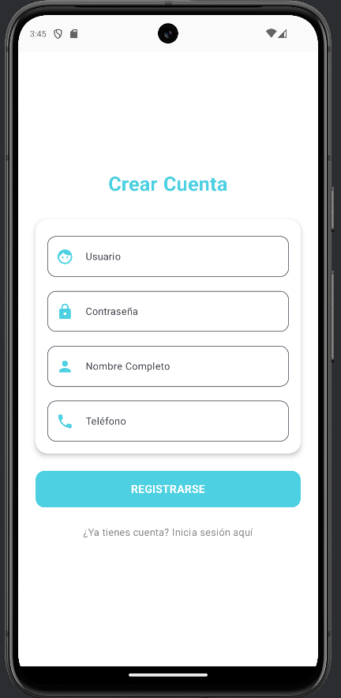
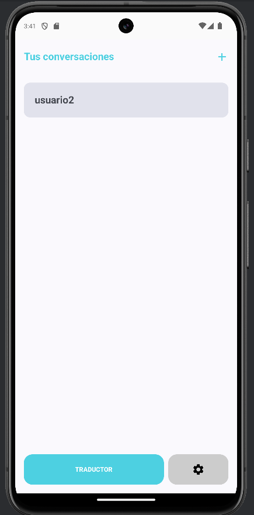
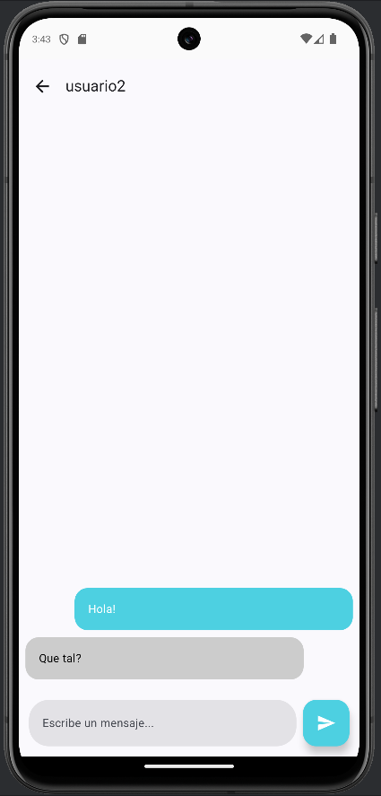
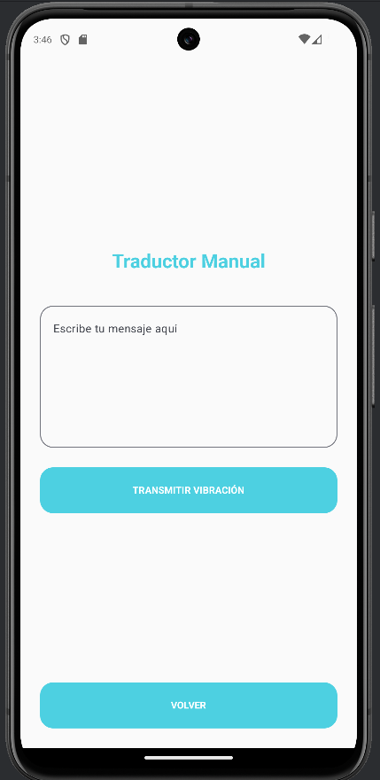
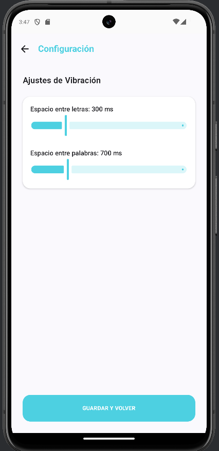

<div align="center">
  

  # 📳 Morse Chat
  
  ### Siente lo que escribes. Mensajería Táctil con Vibración.

  
  
  
  
</div>

---

## 💡 Sobre el Proyecto

**Morse Chat** es una aplicación nativa de Android que reinterpreta la mensajería instantánea añadiendo una capa sensorial: **la vibración háptica**. 

La aplicación no solo permite chatear, sino que **traduce los mensajes de texto a patrones de vibración (Código Morse)** en tiempo real. Esto permite a los usuarios "leer" mensajes mediante el tacto, una funcionalidad pensada para la accesibilidad y la comunicación discreta.

Actualmente funciona como una **Demo Técnica Avanzada**, simulando un entorno de servidor mediante una base de datos local robusta (**Room**), gestionando usuarios, sesiones y persistencia de chat.

---

## 📸 Galería de Vistas

> *La interfaz sigue las guías de Material Design 3, priorizando la claridad y la accesibilidad.*

| **Acceso Seguro** | **Registro de Usuarios** |
|:---:|:---:|
|  |  |
| *Inicio de sesión validado.* | *Formulario de creación de cuenta.* |

| **Mis Conversaciones** | **Chat Interactivo** |
|:---:|:---:|
|  |  |
| *Lista de contactos. Un toque vibra el nombre.* | *Envío y recepción. Toca el mensaje para sentirlo.* |

| **Traductor Manual** | **Ajustes de Vibración** |
|:---:|:---:|
|  |  |
| *Playground: Escribe y transmite vibración.* | *Calibración precisa de la velocidad del Morse.* |

---

## 🧠 Justificación de Diseño y Accesibilidad

Este proyecto ha sido diseñado siguiendo los principios de **"Design for All"** (Diseño para todos), priorizando la usabilidad para personas con diversidad funcional visual o auditiva.

### 1. Selección de Necesidad Social
Detectamos una carencia en las aplicaciones de mensajería instantánea tradicionales: la dependencia absoluta de la vista o el oído.
* **Problema:** Una persona invidente necesita usar TalkBack (que anuncia en voz alta), perdiendo privacidad. Una persona en un entorno de silencio absoluto no puede recibir información discretamente.
* * **Problema:** Una persona con sordo-ceguera no puede usar si quiera esa funcion de TalkBack.
* **Solución:** **Morse Chat** utiliza el canal háptico (tacto/vibración) como medio principal de comunicación, devolviendo la privacidad y la autonomía.

### 2. Decisiones de Interfaz (UI/UX)
La interfaz gráfica se ha construido con **Jetpack Compose** bajo los estándares de Material Design 3, pero con modificaciones específicas para accesibilidad:

* **Paleta de Colores de Alto Contraste:**
    * **Primario:** Cian (`#4DD0E1`). Se eligió sobre el azul estándar por ofrecer mejor visibilidad sobre fondos oscuros y transmitir calma.
    * **Fondos:** Blancos y Grises neutros para evitar fatiga visual.
    * **Diferenciación:** Los mensajes propios y ajenos se distinguen no solo por posición, sino por un contraste de color claro (Cian vs Gris), ayudando a usuarios con daltonismo.

* **Tipografía y Legibilidad:**
    * Se ha implementado un tamaño de fuente base de **22sp** (superior al estándar de 16sp) en los chats.
    * Aumento del `lineHeight` (interlineado) a **30sp** para evitar que las líneas de texto se mezclen visualmente.
    * Uso de fuentes Sans-Serif limpias para facilitar la lectura rápida.

### 3. Accesibilidad Háptica y Motora
* **Feedback Táctil:** Cada interacción importante (enviar mensaje, recibir notificación) tiene una respuesta de vibración, confirmando la acción sin necesidad de mirar la pantalla.
* **Áreas de Toque Ampliadas:** Las burbujas de chat tienen un `padding` interno de **20dp**, creando una superficie de contacto grande. Esto facilita la interacción a usuarios con dificultades motoras o temblores en las manos, reduciendo los "toques fantasma" o errores.

---

## 🏗️ Anexo Técnico: Distribución, Seguridad y Rendimiento (Criterios FFOE)

### 📦 Estrategia de Distribución e Instalación (RA7)

Para garantizar que **Morse Chat** llegue a sus usuarios finales de forma eficiente y profesional, se ha definido la siguiente estrategia de despliegue:

#### 1. Canales de Distribución
* **Repositorio GitHub (Código Abierto):** El canal principal actual. Permite la colaboración comunitaria y la auditoría del código, esencial en proyectos de accesibilidad.
* **Google Play Store (Proyección):** Para una fase de producción, se utilizaría el canal "Beta Testing" de Google Play Console para distribuir actualizaciones automáticas y seguras.
* **Distribución Directa (Sideloading):** Entrega del archivo `.apk` firmado para instalación manual en entornos donde no se dispone de cuentas de Google (ej: dispositivos corporativos restringidos o tablets educativas antiguas).

#### 2. Instalación Desatendida (Enterprise)
En un escenario de despliegue masivo (por ejemplo, instalar la app en 50 tablets de una asociación de personas sordociegas), la instalación manual es inviable. La app está preparada para una **Instalación Desatendida** mediante herramientas MDM (Mobile Device Management) o ADB:

* **Comando ADB:** `adb install -r app-release.apk`
* **Justificación:** Al no requerir permisos peligrosos en tiempo de ejecución (como Cámara o Ubicación) en el primer inicio, la app es funcional inmediatamente después de una instalación silenciosa, facilitando el trabajo a los administradores de sistemas.

---

### 🛡️ Seguridad y Protección de Datos (RA8)

La seguridad en **Morse Chat** se basa en el principio de **"Privacidad por Diseño"**. Al ser una herramienta de comunicación, la integridad de los datos es crítica.

#### 1. Seguridad de la Base de Datos (Room)
* **Sandboxing de Android:** La base de datos SQLite generada por Room se aloja en el directorio privado `/data/data/com.example.vibracion_morse/databases/`. Gracias al aislamiento de procesos de Linux (Kernel de Android), ninguna otra aplicación sin permisos de `ROOT` puede acceder a leer los chats.
* **Sin Permisos de Internet:** Al operar 100% offline, se elimina vector de ataque más común: la interceptación de datos en tránsito (Man-in-the-Middle) o fugas a servidores externos.

#### 2. Medidas de Protección Futuras (Roadmap)
Para elevar el nivel de seguridad a estándares militares/bancarios, se contempla la implementación de:
* **SQLCipher:** Encriptación AES-256 transparente de la base de datos Room. Si alguien robara el teléfono y extrajera el archivo físico, no podría leer el contenido sin la clave.
* **Ofuscación de Código (R8/ProGuard):** Activado en el build `release` para renombrar clases y métodos, dificultando la ingeniería inversa y el análisis malintencionado del APK.

---

### 🧪 Pruebas de Rendimiento y Estrés (RA8)

Se ha analizado teóricamente el comportamiento de la aplicación bajo condiciones de carga extrema (Volumen y Estrés).

#### 1. Gestión de Grandes Volúmenes de Datos
**Escenario:** Un usuario acumula 10.000 mensajes en una conversación.
* **Solución Técnica:** El uso de `LazyColumn` en Jetpack Compose es la clave. A diferencia de un `ScrollView` tradicional, `LazyColumn` solo renderiza en memoria los elementos visibles en pantalla (reciclaje de vistas).
* **Resultado:** Aunque la base de datos contenga 1GB de texto, la memoria RAM consumida por la UI se mantiene constante y baja, evitando el cierre inesperado (ANR - Application Not Responding).

#### 2. Concurrencia y Hilos
**Escenario:** El usuario pulsa el botón "Enviar" repetidamente a alta velocidad mientras se cargan mensajes antiguos.
* **Solución Técnica:** Uso de **Kotlin Coroutines** con el despachador `Dispatchers.IO` para todas las operaciones de base de datos.
* **Resultado:** La interfaz de usuario (Main Thread) nunca se congela, ya que la escritura en disco ocurre en un hilo secundario. El uso de `Flow` permite que la lista se actualice reactivamente sin bloquear la app.

## 🚀 Funcionalidades Clave

### 📳 Motor Háptico Morse
- **Traducción en tiempo real:** Algoritmo optimizado para convertir `String` -> `Patrón de Vibración`.
- **Compatibilidad Dual:** Soporte para APIs antiguas (`Vibrator`) y modernas (`VibratorManager` en Android 12+).
- **Control de Velocidad:** El usuario puede definir en milisegundos la duración entre "Puntos", "Rayas" y "Espacios" desde los ajustes.

### 💾 Arquitectura de Datos (Local)
- **Persistencia con Room:** Base de datos SQLite abstracta.
- **Relaciones:** Sistema relacional completo entre Usuarios y Mensajes.
- **Lógica Bidireccional:** Simulación de backend; al crear un chat desde el "Usuario A", se genera automáticamente la entrada inversa para el "Usuario B".

### 👆 Experiencia de Usuario (UX)
- **Toque para leer:** Al pulsar cualquier mensaje en el chat, el teléfono vibra el patrón: *"{Nombre} DIJO {Mensaje}"*.
- **Identificación háptica:** En la lista de contactos, un toque corto vibra el nombre del usuario para identificarlo sin mirar.

---

## 🛠️ Stack Tecnológico

El proyecto está construido siguiendo las mejores prácticas de desarrollo moderno en Android:

* **Lenguaje:** [Kotlin](https://kotlinlang.org/) (100%)
* **UI:** [Jetpack Compose](https://developer.android.com/jetpack/compose) (Declarativa)
* **Arquitectura:** MVVM (Model-View-ViewModel)
* **Inyección de Dependencias:** ViewModel Factory manual (preparado para Hilt/Koin).
* **Asincronía:** Coroutines & Kotlin Flows.
* **Navegación:** Jetpack Navigation Compose con paso de argumentos tipados.

### 📊 Análisis de Consumo de Recursos (Evidencia RA8)

Se ha realizado un perfilado en tiempo real (Profiling) de la aplicación durante una sesión de uso intensivo (envío de mensajes y navegación).


**Interpretación de los datos obtenidos:**
* **Estabilidad de Memoria (RAM):** Como se observa en la gráfica inferior (zona azul), el consumo de memoria se mantiene **plano y estable** en torno a los **113-128 MB**, incluso tras navegar por varias pantallas. Esto demuestra la ausencia de fugas de memoria (Memory Leaks) y la eficiencia del reciclaje de vistas de `Jetpack Compose`.
* **Eficiencia de CPU:** El consumo de procesador (gráfica superior) se mantiene cercano al **0%** en reposo, con picos puntuales únicamente coincidentes con las interacciones del usuario (puntos rosas en la línea de tiempo), validando la arquitectura reactiva del proyecto.

### 🗄️ Esquema de Base de Datos

```mermaid
erDiagram
    USUARIO ||--o{ CHAT : tiene
    USUARIO ||--o{ MENSAJE : envia
    USUARIO {
        int id PK
        string usuario UK
        string password
        string telefono
    }
    CHAT {
        int id PK
        string propietario
        string contacto
    }
    MENSAJE {
        int id PK
        string remitente
        string destinatario
        string texto
        long timestamp
    }
