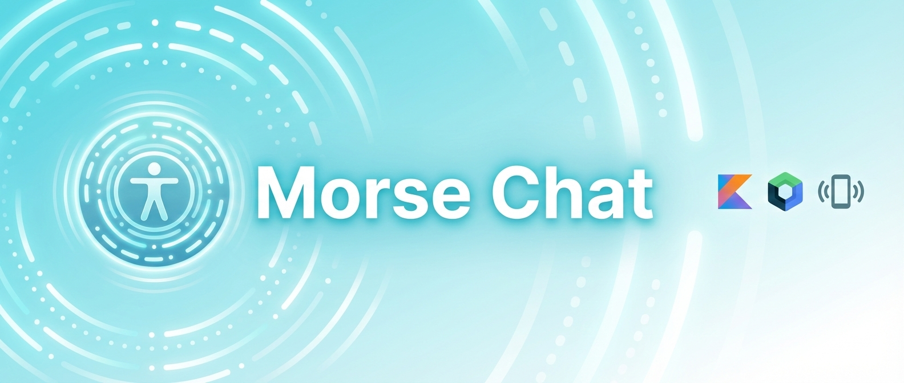

<div align="center">
  

  
  
  
  
</div>

---

## 🏥 Descripción del Proyecto: Herramienta de Gestión Clínica y Comunicación Asistiva

**Morse Chat** ha evolucionado de una simple aplicación de mensajería a una **herramienta integral para entornos clínicos**. Su objetivo es facilitar la comunicación y el seguimiento de pacientes con diversidad funcional (visual o auditiva) mediante **vibración háptica**.

El sistema diferencia dos roles claros:
1.  **Administrador (Profesional de la Clínica):** Gestiona las altas de pacientes, elimina perfiles y realiza el **seguimiento clínico** (historial de evolución con fecha y notas).
2.  **Paciente:** Utiliza la app como herramienta de comunicación asistiva (Traductor Morse y Chat con profesionales).

---

## 📹 Demo en Vídeo
[▶️ Ver Vídeo Explicativo del Proyecto (Google Drive)](https://drive.google.com/file/d/1GlHzIxxDlw2xY5wd2-xpRFyVL3Sz3R_O/view?usp=sharing)

---

# 📝 Memoria Técnica por Criterios de Evaluación (RA)

## RA1. Interfaz Gráfica y Código

### RA1.a Analiza herramientas y librerías
Para el desarrollo de esta solución clínica se han seleccionado herramientas modernas y robustas:
* **Android Studio (Ladybug):** Entorno de desarrollo oficial.
* **Kotlin & Jetpack Compose:** Se ha prescindido del sistema antiguo de XML para crear una interfaz declarativa, más fácil de mantener y adaptar a distintos tamaños de pantalla.
* **Room Database:** Librería fundamental para guardar los datos de pacientes y seguimientos de forma local y segura en la tablet o móvil de la clínica, sin depender de conexión a internet constante.

### RA1.b Crea interfaz gráfica
La interfaz es **adaptativa según el rol** del usuario que inicia sesión. No se muestra lo mismo a un paciente que a un administrador.

* **Panel de Administración:** Muestra un listado de pacientes con botones de acción rápida y colores semánticos (Naranja para seguimiento, Rojo para borrar).
* **Panel de Paciente:** Interfaz simplificada con botones grandes y claros para acceder al Chat o al Traductor, facilitando la accesibilidad.

### RA1.c Uso de layouts y posicionamiento
La estructura visual se basa en el componente `Scaffold`, que nos proporciona la barra superior estándar automáticamente. Para los listados (tanto de pacientes como de historial clínico), utilizamos `LazyColumn`.

**¿Por qué LazyColumn?**
A diferencia de una columna normal, `LazyColumn` solo "dibuja" en pantalla los elementos visibles. Si una clínica tiene 500 pacientes, la app no se bloqueará porque solo cargará los 5 o 6 que caben en la pantalla en ese momento.

### RA1.d Personalización de componentes
Se ha diseñado una identidad visual propia para la clínica:
* **Color Primario:** Cian (`#4DD0E1`), elegido por su alto contraste y visibilidad.
* **Tarjetas (Cards):** Usadas para separar visualmente a cada paciente o registro médico, con bordes redondeados y una elevación suave para dar sensación de profundidad.

### RA1.e Análisis del código
El proyecto sigue la arquitectura **MVVM (Modelo - Vista - ViewModel)**. Esto significa que el código está separado en tres capas para que sea ordenado:
1.  **Datos (Model):** La estructura de la base de datos (Tablas de Usuarios, Seguimientos, etc.).
2.  **Lógica (ViewModel):** Donde se decide qué hacer. Por ejemplo, `HomeViewModel` decide si mostrar la vista de admin o de paciente.
3.  **Visual (View):** Las pantallas que solo muestran lo que el ViewModel les dice.

### RA1.f Modificación del código
El código es modular. Recientemente se añadió la funcionalidad de "Seguimiento Clínico" creando un archivo nuevo `PantallaSeguimiento.kt` y conectándolo al sistema sin romper la funcionalidad de chat existente. Esto demuestra que la app está preparada para crecer.

### RA1.g Asociación de eventos
La app responde de forma natural a las acciones del usuario.
* **Ejemplo:** Al pulsar el botón "Guardar Registro" en el historial, el sistema guarda la nota en la base de datos, limpia el campo de texto y actualiza la lista automáticamente.

```kotlin
// Ejemplo sencillo de evento onClick
Button(onClick = { 
    viewModel.agregarRegistro(pacienteId) // Llama a la lógica
}) {
    Text("GUARDAR REGISTRO")
}
