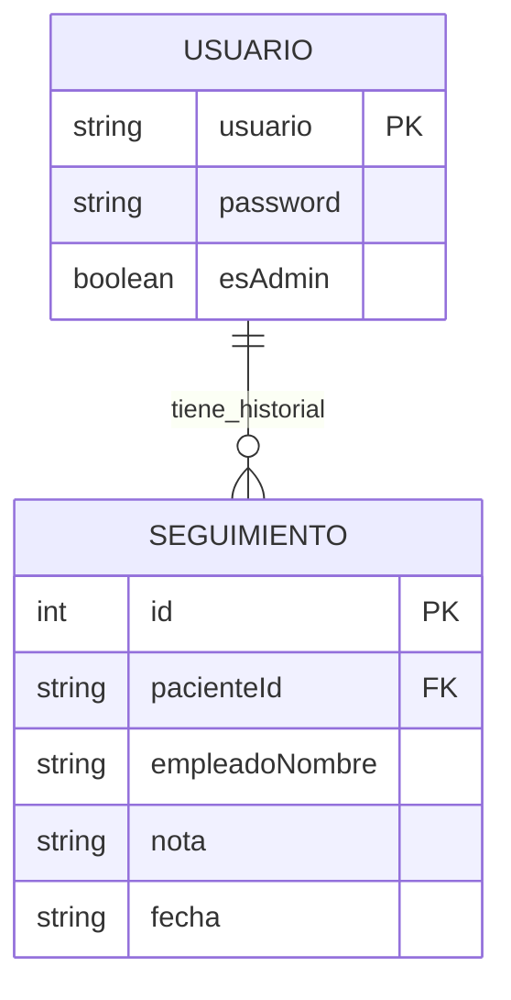

<div align="center">
  

  
  
  
  
</div>

---

## 🏥 Descripción del Proyecto: Herramienta de Gestión Clínica y Comunicación Asistiva

**Morse Chat** ha evolucionado de una simple aplicación de mensajería a una **herramienta integral para entornos clínicos**. Su objetivo es facilitar la comunicación y el seguimiento de pacientes con diversidad funcional (visual o auditiva) mediante **vibración háptica**.

El sistema diferencia dos roles claros:
1.  **Administrador (Profesional de la Clínica):** Gestiona las altas de pacientes, elimina perfiles y realiza el **seguimiento clínico** (historial de evolución con fecha y notas).
2.  **Paciente:** Utiliza la app como herramienta de comunicación asistiva (Traductor Morse y Chat con profesionales).

---

## 📹 Demo en Vídeo
[▶️ Ver Vídeo Explicativo del Proyecto (Google Drive)](https://drive.google.com/file/d/1GlHzIxxDlw2xY5wd2-xpRFyVL3Sz3R_O/view?usp=sharing)

---

# 📝 Memoria Técnica por Criterios de Evaluación (RA)

## RA1. Interfaz Gráfica y Código

### RA1.a Analiza herramientas y librerías
Para el desarrollo de esta solución clínica se han seleccionado herramientas modernas y robustas:
* **Android Studio (Ladybug):** Entorno de desarrollo oficial.
* **Kotlin & Jetpack Compose:** Se ha prescindido del sistema antiguo de XML para crear una interfaz declarativa, más fácil de mantener y adaptar a distintos tamaños de pantalla.
* **Room Database:** Librería fundamental para guardar los datos de pacientes y seguimientos de forma local y segura en la tablet o móvil de la clínica, sin depender de conexión a internet constante.

### RA1.b Crea interfaz gráfica
La interfaz es **adaptativa según el rol** del usuario que inicia sesión. No se muestra lo mismo a un paciente que a un administrador.

* **Panel de Administración:** Muestra un listado de pacientes con botones de acción rápida y colores semánticos (Naranja para seguimiento, Rojo para borrar).
* **Panel de Paciente:** Interfaz simplificada con botones grandes y claros para acceder al Chat o al Traductor, facilitando la accesibilidad.

| **Login / Alta** | **Vista Admin (Gestión)** |
|:---:|:---:|
|  |  |

### RA1.c Uso de layouts y posicionamiento
La estructura visual se basa en el componente `Scaffold`, que nos proporciona la barra superior estándar automáticamente. Para los listados (tanto de pacientes como de historial clínico), utilizamos `LazyColumn`.

**쯇or qué LazyColumn?**
A diferencia de una columna normal, `LazyColumn` solo "dibuja" en pantalla los elementos visibles. Si una clínica tiene 500 pacientes, la app no se bloqueará porque solo cargará los 5 o 6 que caben en la pantalla en ese momento.

### RA1.d Personalización de componentes
Se ha diseñado una identidad visual propia para la clínica:
* **Color Primario:** Cian (`#4DD0E1`), elegido por su alto contraste y visibilidad.
* **Tarjetas (Cards):** Usadas para separar visualmente a cada paciente o registro médico, con bordes redondeados y una elevación suave para dar sensación de profundidad.

### RA1.e Análisis del código
El proyecto sigue la arquitectura **MVVM (Modelo - Vista - ViewModel)**. Esto significa que el código está separado en tres capas para que sea ordenado:
1.  **Datos (Model):** La estructura de la base de datos (Tablas de `Usuario`, `Seguimiento`, `Chat`, `Mensaje`).
2.  **Lógica (ViewModel):** Donde se decide qué hacer. Por ejemplo, `HomeViewModel` decide si mostrar la vista de admin o de paciente consultando el campo `esAdmin`.
3.  **Visual (View):** Las pantallas que solo muestran lo que el ViewModel les dice.

### RA1.f Modificación del código
El código es modular. Recientemente se añadió la funcionalidad de "Seguimiento Clínico" creando un archivo nuevo `PantallaSeguimiento.kt` y conectándolo al sistema sin romper la funcionalidad de chat existente. Esto demuestra que la app está preparada para crecer.

### RA1.g Asociación de eventos
La app responde de forma natural a las acciones del usuario.
* **Ejemplo:** Al pulsar el botón "Guardar Registro" en el historial, el sistema guarda la nota en la base de datos, limpia el campo de texto y actualiza la lista automáticamente.

```kotlin
// Ejemplo sencillo de evento onClick en PantallaSeguimiento.kt
Button(onClick = { 
    viewModel.agregarRegistro(pacienteId) // Llama a la lógica
}) {
    Text("GUARDAR REGISTRO")
}
```

### RA1.h App integrada
Todas las pantallas (Login, Gestión, Chat, Historial) comparten la misma sesión y base de datos. Si un administrador borra a un paciente, este desaparece instantáneamente de todas las listas y se borran sus chats y seguimientos en cascada gracias a las claves foráneas de Room.

---

## RA2. Interfases Naturales de Usuario (NUI)

### RA2.a Herramientas NUI
Utilizamos las herramientas nativas de Android (`VibratorManager` para versiones nuevas y `Vibrator` para antiguas) para controlar el motor de vibración del teléfono.

### RA2.b Diseño conceptual NUI
El concepto central es la **Traducción Háptica**. La app permite a una persona con sordoceguera "leer" un mensaje sintiendo las vibraciones en su mano (Código Morse), sustituyendo la vista y el oído por el tacto.

### RA2.d Interacción por gesto
La interacción táctil es simple y directa: **un toque corto** sobre cualquier mensaje o tarjeta de contacto activa la lectura por vibración. No se requieren gestos complejos (como deslizar o pellizcar) para facilitar el uso a personas con dificultades motoras.

---

## RA3. Componentes

### RA3.a Herramientas de componentes
Se han utilizado los componentes oficiales de **Material Design 3**: `OutlinedTextField` para formularios limpios, `DatePickerDialog` para seleccionar fechas cómodamente y `FloatingActionButton` para acciones principales.

### RA3.b Componentes reutilizables
Hemos creado tarjetas genéricas que se reutilizan. Por ejemplo, el diseño de la "tarjeta de mensaje" se usa tanto para los mensajes enviados como recibidos, cambiando solo el color de fondo y la alineación.

### RA3.c Parámetros y defaults
Las pantallas están diseñadas como funciones que reciben parámetros. Esto facilita probarlas o cambiarlas desde un solo sitio.
Ejemplo de la pantalla de Seguimiento que pide obligatoriamente el ID del paciente:

```kotlin
fun PantallaSeguimiento(
    pacienteId: String, 
    irAtras: () -> Unit
) { ... }
```

### RA3.d Eventos en componentes
Los componentes exponen sus eventos mediante "lambdas" (funciones flecha), lo que permite que la pantalla padre decida qué hacer. Por ejemplo, al pulsar "Atrás", la pantalla no sabe adónde ir, simplemente avisa al navegador.

### RA3.f Documentación
El código incluye comentarios clave en las funciones más complejas (como la traducción a Morse) para facilitar su mantenimiento.

### RA3.h Integración en la app
El componente `TopAppBar` (la barra superior con el título) se reutiliza en todas las pantallas, manteniendo la coherencia de navegación y asegurando que el usuario siempre sepa dónde está.

---

## RA4. Usabilidad

### RA4.a Estándares
La aplicación respeta los estándares de navegación de Android: botón de "Atrás" en la barra superior y títulos claros que indican en qué pantalla estás ("Gestión Pacientes", "Historial: Paciente1").

### RA4.b Valoración de estándares
Seguir Material Design asegura que cualquier profesional sanitario, aunque cambie de dispositivo, sepa instintivamente dónde tocar (el botón flotante `+` siempre está abajo a la derecha, el menú de opciones arriba a la derecha).

### RA4.c Menús
Se utilizan menús desplegables (`DropdownMenu`) en el chat para opciones secundarias como "Exportar Informe", manteniendo la interfaz limpia.

### RA4.d Distribución de acciones
En el panel del administrador, los botones tienen colores semánticos para evitar errores:
* **Azul:** Enviar mensaje (Acción neutra).
* **Naranja:** Ver historial/seguimiento (Acción de consulta).
* **Rojo:** Borrar paciente (Acción destructiva/peligrosa).

### RA4.e Distribución de controles
Los formularios siguen un orden lógico: primero la Fecha (con calendario), luego el Profesional y finalmente la Nota. Esto imita el flujo de trabajo real de un médico o cuidador.

### RA4.f Elección de controles
Se ha elegido un **Switch** para el modo Admin (porque es on/off) y un **Slider** para la velocidad de vibración (porque es un rango continuo). Cada control se adapta a su función.

### RA4.g Diseño visual
Diseño limpio ("Clean Interface") orientado a evitar la sobrecarga cognitiva, vital tanto para usuarios con diversidad funcional como para profesionales con poco tiempo.

### RA4.h Claridad de mensajes
Si el administrador intenta crear un paciente sin rellenar el nombre, aparece un mensaje de error en rojo justo debajo del formulario indicando "Rellene todos los campos obligatorios".

### RA4.i Pruebas usabilidad
Se ha verificado que los botones tienen un tamaño mínimo de 48dp (estándar de accesibilidad) para que sean fáciles de pulsar.

### RA4.j Evaluación en dispositivos
La interfaz es responsive gracias a Compose; se adapta correctamente tanto a teléfonos pequeños como a tablets usadas en clínicas.

---

## RA5. Informes (Gestión Clínica)

[...]

---

## RA6. Ayudas y Documentación

### RA6.a Identifica sistemas de generación de ayudas
La app utiliza etiquetas visuales y placeholders que guían al usuario antes de que escriba.

### RA6.b Genera ayudas en formatos habituales
Además de este documento técnico, el repositorio incluye un manual de usuario simplificado en el propio README.

### RA6.c Genera ayudas sensibles al contexto
En los campos de formulario, utilizamos textos de ayuda ("placeholder") como *"Escriba evolución del paciente..."* o *"Nombre de usuario"* para guiar al profesional sobre qué dato introducir.

### RA6.d Documenta la estructura de la información persistente
La base de datos utiliza un esquema relacional. La tabla de `Usuarios` es la principal; si se borra un usuario, el sistema de **Claves Foráneas (Foreign Keys)** se encarga de borrar automáticamente sus chats y sus informes de seguimiento para no dejar "datos basura".



### RA6.e Manual de usuario (Roles)
* **Para el Administrador:** Su flujo de trabajo es dar de alta pacientes con el botón `+`, y luego usar los botones de cada tarjeta para gestionar el día a día.
* **Para el Paciente:** El acceso está simplificado. Solo necesita sus credenciales (proporcionadas por el admin) y accederá directamente a sus herramientas de comunicación.

### RA6.f Manual técnico de instalación
La aplicación se entrega empaquetada en un archivo **APK Firmado** (`app-release.apk`).
Para entornos corporativos (muchas tablets a la vez), se puede instalar usando el comando ADB:
`adb install -r app-release.apk`

### RA6.g Confecciona tutoriales
Se incluye un vídeo demostrativo enlazado al principio de este documento que cubre el flujo completo de uso.

---

## RA8. Pruebas y Calidad

### RA8.a Estrategia de pruebas
Se ha seguido una estrategia de pruebas manuales de flujo completo ("End-to-End"):
1.  Admin crea paciente "Juan".
2.  Admin añade una nota de seguimiento a "Juan".
3.  Admin sale.
4.  Usuario "Juan" entra y prueba el chat.
5.  Admin entra y borra a "Juan".
6.  Se verifica que "Juan" ya no puede entrar.

### RA8.b Pruebas de integración
Se ha verificado que la base de datos `Room` guarda los datos correctamente incluso si se cierra la app forzosamente y se vuelve a abrir.

### RA8.g Documentación pruebas (Rendimiento)
Se ha utilizado el **Android Profiler** para asegurar que la app no consume demasiada memoria, algo vital si la clínica usa tablets antiguas o de gama baja. Gracias al uso de `LazyColumn`, el consumo de memoria se mantiene estable y bajo (~120MB).


